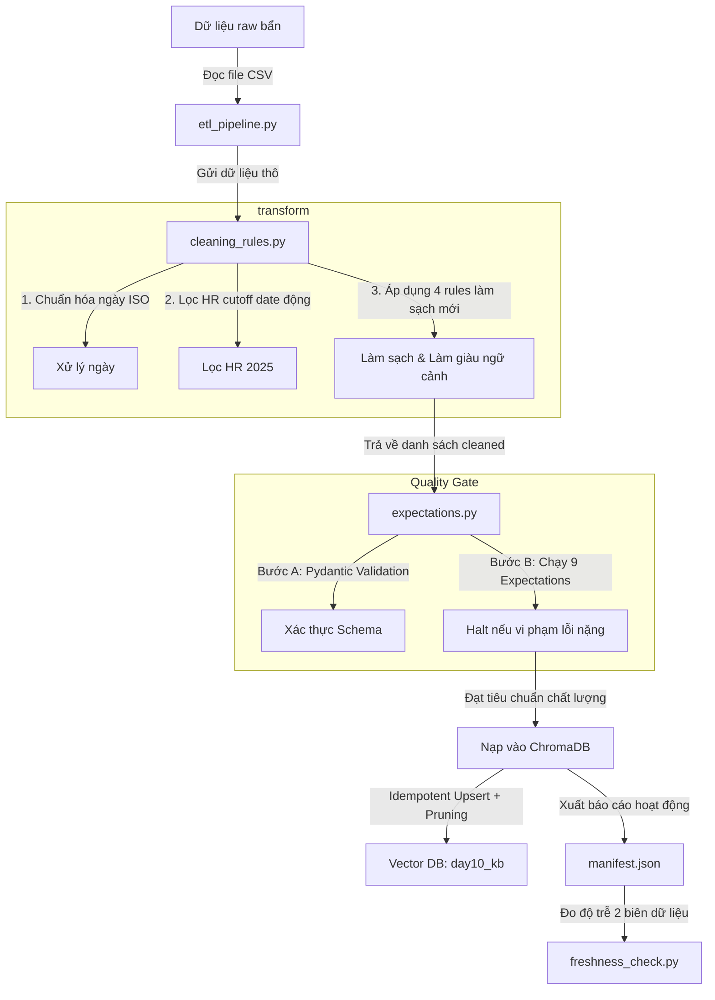

# Tài liệu Giải thích Toàn bộ Code — Lab Day 10

Tài liệu này giải thích chi tiết cấu trúc thư mục, các module code, logic nghiệp vụ đã tinh chỉnh và cách toàn bộ hệ thống hoạt động cùng nhau để làm sạch và quan sát (observability) dữ liệu RAG.

---

## 1. Cấu trúc Tổng quan của Dự án

Dự án là một **Pipeline ETL (Extract - Transform - Load)** thu nhỏ tích hợp kiểm định chất lượng nâng cao (Quality Gate) và đo lường độ tươi (Freshness):

```
lab/
├── etl_pipeline.py           # Điểm khởi chạy (Entrypoint) của toàn bộ luồng ETL
├── transform/
│   └── cleaning_rules.py     # Nơi xử lý làm sạch, chuẩn hóa, lọc version và làm giàu ngữ cảnh
├── quality/
│   └── expectations.py       # Trạm gác chất lượng dữ liệu (Pydantic + Expectation Suite)
├── monitoring/
│   └── freshness_check.py    # Đo lường độ trễ dữ liệu ở hai biên (Ingestion và Publish)
└── contracts/
    └── data_contract.yaml    # Bản giao ước dữ liệu (chứa cấu hình allowlist, SLA, Cutoff Date)
```

---

## 2. Chi tiết luồng xử lý và Mã nguồn

### 2.1. Bản giao ước dữ liệu (`contracts/data_contract.yaml`)
Đây là nơi cấu hình tập trung các quy tắc và thông số nghiệp vụ. Giúp tránh việc **hardcode** các giá trị trong code.
- **Cho phép tài liệu SOP:** Thêm `access_control_sop` vào danh sách `allowed_doc_ids`.
- **Cấu hình Cutoff Date cho HR:** Thuộc tính `policy_versioning.hr_leave_min_effective_date` được cấu hình là `"2026-01-01"` để loại bỏ các chính sách cũ (năm 2025).

---

### 2.2. Điểm khởi chạy (`etl_pipeline.py`)
File này quản lý vòng đời chạy của pipeline. Lệnh chạy chính:
`python etl_pipeline.py run`

Các bước chính được thực hiện tuần tự:
1. **Extract:** Đọc dữ liệu thô từ `data/raw/policy_export_dirty.csv`.
2. **Transform (Clean):** Gọi hàm `clean_rows()` từ module `cleaning_rules.py`.
3. **Validate:** Gọi hàm `run_expectations()` từ module `expectations.py`.
   - Nếu phát hiện lỗi có thuộc tính `severity = "halt"`, pipeline lập tức **dừng chạy** (exit code 2) để ngăn dữ liệu bẩn lọt vào cơ sở dữ liệu.
   - Nếu chỉ cảnh báo (`severity = "warn"`), in log cảnh báo và tiếp tục chạy.
4. **Load (Embed & Upsert):** Chuyển đổi văn bản sạch sang vector qua mô hình `all-MiniLM-L6-v2` và nạp vào **ChromaDB**.
   - **Idempotency (Natural Key Upsert):** Ghi đè vector cũ nếu `chunk_id` trùng khớp để tránh phình dữ liệu khi chạy lại nhiều lần.
   - **Index Pruning:** Đối chiếu và xóa các vector cũ trong DB không còn xuất hiện trong lần chạy này.
5. **Freshness Check:** Ghi nhận trạng thái độ tươi của dữ liệu và xuất file manifest JSON.

---

### 2.3. Làm sạch dữ liệu (`transform/cleaning_rules.py`)
Đây là nơi áp dụng các quy tắc để biến dữ liệu bẩn thành dữ liệu sạch.

#### Các logic baseline:
- **Allowlist filter:** Loại bỏ các dòng có `doc_id` lạ nằm ngoài 5 tài liệu hợp lệ.
- **Date Normalization:** Chuyển đổi ngày hiệu lực từ `DD/MM/YYYY` hoặc các định dạng lỗi về định dạng chuẩn ISO `YYYY-MM-DD`.
- **Dynamic HR Cutoff Date:** Hàm `get_hr_leave_min_effective_date()` đọc động tệp `data_contract.yaml` để lấy mốc ngày `"2026-01-01"`. Bất kỳ chính sách HR nào có ngày hiệu lực trước mốc này (phiên bản 2025) sẽ bị **cô lập vào Quarantine** thay vì nạp vào DB.

#### 4 Rules mới được bổ sung:
- **Rule 1 (Bỏ tiền tố lỗi):** Cắt bỏ đoạn chuỗi `"Nội dung không rõ ràng: "` ở đầu văn bản để nội dung chunk tập trung hơn.
- **Rule 2 (Bỏ ký tự nhiễu):** Loại bỏ các ký tự dấu chấm than gây nhiễu `"!!!"` ở đầu và cuối văn bản.
- **Rule 3 (Dự phòng lặp từ):** Loại bỏ lỗi đánh máy lặp từ kép phổ biến như `"làm việc làm việc"` thành `"làm việc"`.
- **Rule 4 (Làm giàu ngữ cảnh - Context Enrichment):** 
  Đối với tài liệu `sla_p1_2026`, chuyển cụm từ `"Escalation P1"` thành `"Escalation ticket P1 (auto escalate)"`. Điều này giúp mô hình nhúng vector dễ dàng khớp câu hỏi tiếng Anh với nội dung tài liệu tiếng Việt, đẩy thứ hạng truy vấn từ hạng 8 lên hạng 1.

---

### 2.4. Trạm gác chất lượng (`quality/expectations.py`)

#### A. Xác thực Schema với Pydantic:
- Lớp `CleanedChunkSchema` kế thừa từ `pydantic.BaseModel` để đảm bảo mỗi bản ghi sạch phải có đủ các trường bắt buộc và có nội dung văn bản hợp lệ (`min_length=1`).
- `@field_validator('effective_date')` kiểm tra định dạng ngày hiệu lực phải khớp chuẩn ISO `YYYY-MM-DD`. Nếu sai, Pydantic sẽ tự ném ra ngoại lệ xác thực giúp ngăn chặn dữ liệu rỗng hoặc sai định dạng.

#### B. Expectation Suite (9 bài test chất lượng):
- **E0 (pydantic_schema_validation - halt):** Kiểm tra toàn bộ lỗi schema từ lớp Pydantic ở trên.
- **E1 (min_one_row - halt):** Đảm bảo tệp đầu ra không bị trống hoàn toàn sau khi clean.
- **E2 (no_empty_doc_id - halt):** Cấm các dòng thiếu trường định danh tài liệu `doc_id`.
- **E3 (refund_no_stale_14d_window - halt):** Đảm bảo chính sách hoàn tiền không còn tồn tại cửa sổ "14 ngày làm việc" (đã phải được rule tự động sửa thành 7 ngày).
- **E4 (chunk_min_length_8 - warn):** Cảnh báo nếu có đoạn văn bản quá ngắn (dưới 8 ký tự).
- **E5 (effective_date_iso_yyyy_mm_dd - halt):** Kiểm tra định dạng ngày hiệu lực.
- **E6 (hr_leave_no_stale_10d_annual - halt):** Đảm bảo không còn chính sách phép năm cũ "10 ngày phép năm (bản HR 2025)" lọt qua.
- **E7 (no_future_effective_date - warn):** *(Rule mới)* Cảnh báo nếu ngày hiệu lực lớn hơn ngày hiện tại (ngày ở tương lai).
- **E8 (min_four_unique_doc_types - halt):** *(Rule mới)* Đảm bảo pipeline nạp đa dạng nguồn thông tin (phải có ít nhất 4 nguồn tài liệu unique được tải thành công).

---

### 2.5. Kiểm soát độ tươi dữ liệu (`monitoring/freshness_check.py`)
Triển khai kiểm tra **Double-Boundary Freshness** (độ tươi ở 2 biên):
1. **Ingestion Boundary:** Đo khoảng cách thời gian giữa thời điểm dữ liệu được xuất ở hệ thống nguồn (`latest_exported_at` lấy từ CSV nguồn) với thời gian thực thi pipeline hiện tại.
   - *Tại sao Fail trên dữ liệu mẫu?* Vì tệp xuất mẫu có timestamp là `2026-04-10` (đã cũ hơn 1400 giờ, vượt quá SLA 24 giờ). Đây là cảnh báo hữu ích chỉ ra dữ liệu thô đầu vào của hệ thống nguồn đã lâu không được xuất mới.
2. **Publish Boundary:** Đo khoảng cách từ thời điểm nạp vector store (`run_timestamp` được ghi khi chạy pipeline) so với hiện tại.
   - *Kết quả:* `PASS` (bằng 0 giờ) vì dữ liệu vừa mới được ghi vào DB.

---

### 2.6. Chạy Đánh giá và Grading (`grading_run.py` & `eval_retrieval.py`)
- **`eval_retrieval.py`:** Chạy 21 câu hỏi tự kiểm thử và xuất ra file CSV kết quả so sánh trước/sau khi clean.
- **`grading_run.py`:** Bộ chấm điểm chính thức của giảng viên gồm 10 câu hỏi cốt lõi để xác minh RAG Agent lấy được context sạch và chính xác nhất. Kết quả ghi nhận tại `grading_run.jsonl`.
- **`instructor_quick_check.py`:** Công cụ kiểm tra nhanh định dạng và kết quả các câu chấm điểm để đảm bảo không bị lỗi cú pháp trước khi nộp bài.

---

## 3. Cách các thành phần phối hợp (Workflow)


- Khi dữ liệu đi qua luồng này, bất kỳ sự cố bất thường nào về kiểu dữ liệu hoặc vi phạm chính sách kinh doanh (như hoàn tiền 14 ngày) đều được phát hiện và xử lý tự động.
- Dữ liệu cuối cùng được lưu trữ ổn định trong Vector store giúp RAG Agent luôn truy xuất được thông tin chuẩn xác và mới nhất.
