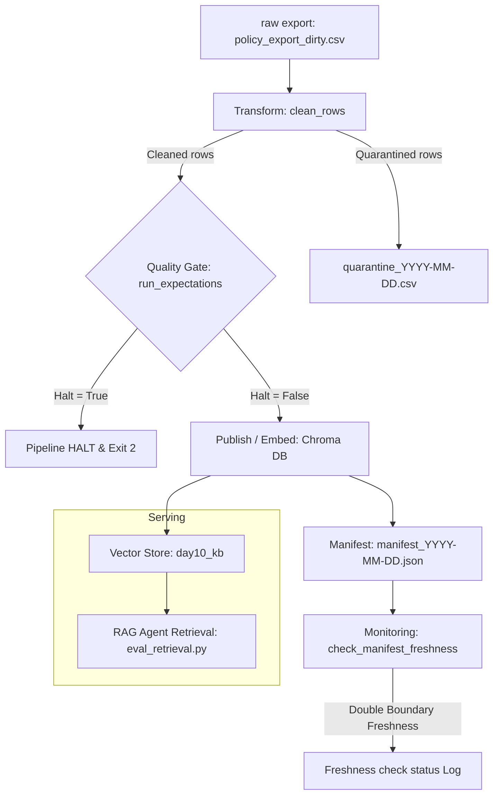

# Kiến trúc pipeline — Lab Day 10

**Nhóm:** CS-IT-Ops
**Cập nhật:** 2026-06-10

---

## 1. Sơ đồ luồng (Mermaid)

*Trong đó:*
- **Freshness Measurement:** Đo độ tươi (freshness) ở hai biên: biên Ingestion (tính từ `latest_exported_at`) và biên Publish (tính từ `run_timestamp`).
- **Run ID & Manifest:** Mỗi lần chạy pipeline sinh ra một `run_id` duy nhất và ghi vào log cũng như manifest file JSON.
- **Quarantine:** Các dữ liệu bẩn bị đẩy vào file CSV riêng trong thư mục `artifacts/quarantine/` kèm theo lý do cô lập để audit.

---

## 2. Ranh giới trách nhiệm

| Thành phần | Input | Output | Owner nhóm |
|------------|-------|--------|--------------|
| **Ingest** | `data/raw/policy_export_dirty.csv` | List of dict rows | Ingestion Owner |
| **Transform** | Raw rows | Cleaned rows & Quarantine rows | Cleaning / Quality Owner |
| **Quality** | Cleaned rows | Expectation results (warn/halt) | Cleaning / Quality Owner |
| **Embed** | Cleaned CSV | Chroma Collection `day10_kb` | Embed Owner |
| **Monitor** | Manifest JSON | Freshness status (PASS/WARN/FAIL) | Monitoring / Docs Owner |

---

## 3. Idempotency & rerun

- **Strategy:** Pipeline sử dụng cơ chế **Natural Key Upsert** kết hợp với **Index Pruning**.
  - `chunk_id` được sinh ra ổn định dựa trên hàm hash SHA-256 từ nội dung văn bản (`chunk_text`), `doc_id`, và số thứ tự logic (`seq`). Do đó, nếu nội dung không đổi, `chunk_id` sẽ hoàn toàn trùng khớp giữa các lần chạy.
  - Khi lưu trữ vào ChromaDB, hàm `col.upsert()` được gọi. Rerun nhiều lần sẽ ghi đè các vector cũ có cùng `chunk_id` thay vì tạo mới, tránh phình to tài nguyên.
  - Sau khi nạp, pipeline thực hiện so sánh tập hợp `chunk_id` mới với các ID cũ có sẵn trong collection và thực hiện **prune** (xoá bỏ các vector thừa không còn tồn tại trong run này). Chiến lược này đảm bảo sự đồng bộ tuyệt đối giữa cơ sở dữ liệu vector và file dữ liệu sạch đã được làm sạch cuối cùng.

---

## 4. Liên hệ Day 09

- Pipeline này đóng vai trò cung cấp dữ liệu nền (Knowledge Base) sạch, đáng tin cậy cho RAG Agent ở Day 08 và Day 09.
- Bằng cách phân tách collection thành `day10_kb`, chúng ta cô lập được môi trường thử nghiệm dữ liệu mới, tránh việc Agent sử dụng nhầm các chunk dữ liệu cũ chưa qua quy trình làm sạch (như chính sách hoàn tiền 14 ngày làm việc đã lỗi thời). Sau khi kiểm định thành công, Agent chỉ cần cấu hình để trỏ sang collection `day10_kb` này.

---

## 5. Rủi ro đã biết

- **High Disk I/O latency (như OneDrive/Dropbox):** Việc đọc/ghi liên tục các file log và file DB tạm thời có thể bị chậm do cơ chế đồng bộ đám mây của hệ điều hành.
- **Schema Drift:** Nếu hệ thống xuất dữ liệu raw thay đổi tên cột hoặc kiểu dữ liệu mà không cập nhật schema Pydantic, pipeline sẽ halt lập tức do lỗi xác thực chất lượng.
